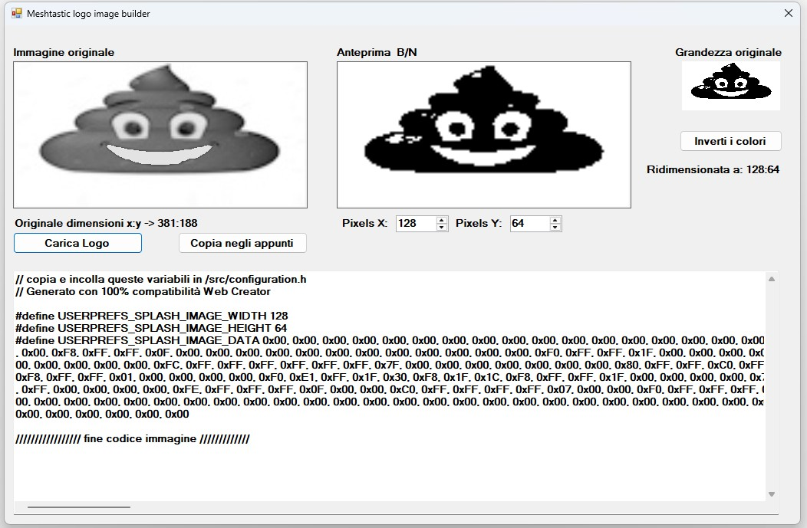

# meshtastic-firmwares-ITA
***meshtastic-firmware-2.7.22.96dd647 (ultima release alpha) meshtastic-firmware-2.7.15. (ultima release beta)***


🇮🇹 Meshtastic Italia "Smart Power" Edition


Firmware Modificato - Pronto all'uso per meshtastic italia!
Questo non è il solito firmware. È una versione "Zero Configuration" pensata per gli utenti italiani, che integra la potenza del mesh network con il controllo domotico avanzato.

🔥 Cosa c'è "sotto il cofano"?

🛰️ Canali Pre-Configurati (8 Slot)
Dimentica la configurazione manuale. Al primo avvio troverai già impostati:

Slot 0: MediumFast (Default)

Slot 1-6: Canali Regionali (Ita-Nord, Centro, Sud, Help, Test, Shop) con PSK dedicata.

Slot 7: Canale Nazionale "Italia".

🕹️ Domotica Integrata (Password Protected)
Gestisci i tuoi carichi via radio con messaggi criptati:

Relay 1 ("luce"): GPIO 2.

Relay 2 ("pompa"): GPIO 5.

Comandi: Utilizza le password preimpostate ApritiSesamo_123! e ChiuditiSesamo_123!.

❄️ Cooling System  
### ❄️ Sistema di Raffreddamento Intelligente
Il cuore del progetto è la gestione dinamica della temperatura per evitare il ***thermal throttling*** dei componenti (ESP32/LoRa) all'interno di box stagni esposti al sole.

* **Controllo Isteresi:** Attivazione automatica ventola a **42°C** e spegnimento a **35°C** (previene cicli ON/OFF troppo brevi).
* **Fail-Safe Logic:** In caso di errore del sensore, il sistema logga l'anomalia e mantiene lo stato di sicurezza per proteggere l'hardware.
* **Hardware:** Testato su **Heltec V3/V4** con ventole 5V/12V tramite transistor o modulo relay su ***GPIO 1***.

---

### 🌡️ Ghost Telemetry: Iniezione Dati Combinati (Temp + Hum)

Il sistema utilizza una tecnica di **"Data Injection"** per trasmettere simultaneamente temperatura e umidità all'interno di un singolo pacchetto di telemetria standard, ottimizzando il traffico mesh e garantendo la compatibilità con tutte le app Meshtastic.

#### 📊 Come leggere il dato (Campo Voltage)
Quando la funzionalità è attiva, il valore visualizzato nel campo **Volt (V)** della telemetria non indica una tensione elettrica, ma una stringa numerica composta:

* **Parte Intera (Gradi):** Rappresenta la temperatura della Box in °C.
* **Parte Decimale (Umidità):** Rappresenta la percentuale di umidità relativa (HR%).

> ***Esempio di lettura:***
> Se leggi **`32.65 V`** sul display o sull'app, significa:
> * **Temperatura Box:** 32°C
> * **Umidità:** 65%

---


### 📡 Matrice Sensori I2C Supportati (Auto-Discovery)0

Il firmware esegue uno scanning del bus I2C all'avvio, supportando ***nativamente*** una vasta gamma di sensori (in pratica tutti quello gia supportati nativamente da meshtastic!). 

Il sistema riconosce gli indirizzi e adatta l'algoritmo di lettura:

Il firmware scansiona il bus I2C all'avvio e mappa automaticamente i sensori. 

Ecco la lista dei sensori compatibili e i relativi indirizzi predefiniti:

| Indirizzo | Sensore / Serie | Caratteristiche Principali |
| :--- | :--- | :--- |
| **0x76 / 0x77** | **BME280 / BMP280** | Pressione, Temperatura (BME: +Umidità). |
| **0x40** | **SHT2x / SI7013/20/21 / HTU21D** | Umidità e Temperatura (Alta stabilità). |
| **0x44 / 0x45** | **SHT3x / SHT4x** | Precisione professionale, range esteso. |
| **0x38 / 0x39** | **AHT10 / AHT20 / AHT21** | Ottimo rapporto qualità/prezzo, digitali. |


---

### 💡 Nota Tecnica sugli Indirizzi
Alcuni sensori (come il BME280 o l'SHT3x) permettono di cambiare indirizzo tramite un ponticello (saldatura) sul retro del modulo:
* **0x76** è solitamente l'indirizzo di default per i moduli cinesi del BMP/BME.
* **0x77** viene attivato collegando il pin `SDO` a `VCC`.

***Il sistema è progettato per dare priorità all'indirizzo definito in `I2C_FAN_SENSOR_ADDR` per il controllo termico della ventola, utilizzando gli altri sensori rilevati per la telemetria ambientale generale.***

---

### 🛠️ Configurazione Logica (Macro `HAS_HUMIDITY`)

Il comportamento dell'iniezione dipende dalla configurazione hardware tramite macro:

1.  ***HAS_HUMIDITY = 1***
    * **Con sensore Umidità (es. SHT21 o BME280):** Il valore è combinato (es. `25.60` = 25°C e 60% HR).
    * **Senza sensore Umidità (es. BMP280):** Il valore mostrerà `.00` nei decimali (es. `25.00`).
2.  ***HAS_HUMIDITY = 0***
    * La funzione umidità viene disabilitata.
    * Il sistema torna a mostrare la **temperatura reale come numero intero** (es. `25.0 V` = 25.85°C).
    * 
---

### 🔌 Supporto Sensori Legacy e Alternativi
Oltre ai sensori I2C, la variabile di controllo ***fanTemp*** può essere alimentata da:
* **OneWire (DS18B20):** Ideale per sonde digitali cablate su lunghe distanze.
* **Analogico (NTC / LM35):** Lettura diretta tramite ADC per setup a basso costo.
* **DHT Series (DHT11 / DHT22):** Supporto per i classici sensori "single-wire".

---

### 📊 Dashboard "5-1-0-2" su App Meshtastic
Abbiamo rivoluzionato il campo **Current (A)** della telemetria. Non leggerai milliampere casuali, ma un ***display di stato digitale a 3 cifre***.

Ogni posizione numerica rappresenta un dispositivo:
**Cifra 1: Ventola | Cifra 2: Relay 1 (Luce) | Cifra 3: Relay 2 (Pompa)**

#### 💡 Legenda Codici:
* **1**: **ON** (Dispositivo attivo)
* **0**: **OFF** (Dispositivo spento)
* **2**: **INATTIVO** (Pin non configurato o sensore assente)

> **Esempio:** Se l'app mostra **5102.0 A**, significa: Ventola **ON**, Relay 1 **OFF**, Relay 2 **NON PRESENTE**.
> 
> **Anomalia:** Se l'app mostra **9**102.0 A, significa: Errore nella lettura temperatura ventola, anche se Ventola **ON**, Relay 1 **OFF**, Relay 2 **NON PRESENTE**.

---

# 🚀 Caratteristiche Tecniche e Personalizzazioni

Questo firmware implementa una gestione avanzata del risparmio energetico e del controllo termico, ottimizzata per nodi isolati e installazioni solari professionali.

---

## 🛠️ Guida alla Configurazione (`src/configuration.h`)

Modifica queste macro nel file di configurazione per adattare il firmware al tuo hardware. Il sistema è progettato per essere **autonomo**: una volta impostato, gestisce energia e raffreddamento senza interventi esterni.

```cpp
// ============================================================
// --- MANUTENZIONE & RADIO ---
// ============================================================
#define AUTO_REBOOT_DAYS 5      // Riavvio hardware automatico ogni 5 giorni
#define DBI30 27                // Potenza TX (fino a 27-30 dBi, attenzione alle norme!)

// ============================================================
// --- PROTEZIONE BATTERIA CON ISTERESI ---
// ============================================================
// Impedisce cicli di accensione/spegnimento continui (effetto brown-out)
#define FORCE_SLEEP_MV 3400     // Shutdown profondo sotto i 3.4V

#ifdef FORCE_SLEEP_MV
    #define FORCE_WAKEUP_MV 3700      // Soglia di sblocco/risveglio (3.7V)
    #define FORCE_WAKEUP_HR 12        // Ore di Deep Sleep se la batteria è scarica
    #define ABSOLUTE_SHUTDOWN_COUNT 3  // Numero di conferme voltaggio basso
#endif

// ============================================================
// --- GESTIONE VENTOLA NATIVA (Core-Integrated) ---
// ============================================================
// Il sistema monitora la temperatura e pilota un relay in modo autonomo.
// Il feedback viene inviato tramite Power Metrics (invisibile a Meshtastic).

// 🌡️ SORGENTE TEMPERATURA (Abilitarne solo UNA)
#define I2C_FAN_SENSOR_ADDR 0x76    // Indirizzo I2C (BME280, BMP280, AHT, etc.)
//#define ONEWIRE_TEMP_PIN 4        // Sensore DS18B20
//#define DHT_TEMP_PIN 3            // Sensore DHT11/22
//#define ANALOG_TEMP_PIN 34        // Sensore NTC Analogico (ADC)

// ⚙️ CONFIGURAZIONE RELAY E SOGLIE
#define FAN_RELAY_PIN 1             // Pin fisico modulo Relay (Dashboard Pos. 1)
#define FAN_TEMP_START 42.0f        // Accensione ventola a 42°C
#define FAN_TEMP_STOP 35.0f         // Spegnimento per isteresi a 35°C
```

### 🛠️ Configurazione GPIO (Ottimizzata)
I pin sono stati scelti per garantire la massima stabilità ed evitare conflitti con il display OLED e i sensori interni dell'Heltec:
* **Cooling Fan:** `GPIO 1`
* **Relay 1 (Luce):** `GPIO 2`
* **Relay 2 (Pompa):** `GPIO 5`
---

### 🔗 Integrazione Telemetria
I dati vengono ***iniettati*** nei pacchetti standard di Meshtastic per essere visibili ovunque:
1.  **Voltage Field:** Mostra la temperatura reale del box in °C (es. `45.2 V` = 45.2°C).
2.  **Current Field:** Mostra la Dashboard di stato dei Relay (es. `111 A` = Tutto acceso).
3.  **Piena compatibilità:** Funziona con App Meshtastic, MQTT, Grafana e i log seriali.

---
***"Perché un box che monitora se stesso è un box che non ti lascerà mai a piedi."***
## ❄️ Smart Thermal Control (Ventola)

La gestione del calore è integrata direttamente nel core energetico per la massima affidabilità:

* ***Feedback "Invisibile"***: Lo stato della ventola viene iniettato nelle **Power Metrics**. Vedrai picchi di voltaggio/corrente fittizi nell'app quando la ventola è attiva (ON), permettendoti di monitorare il raffreddamento senza dover abilitare o configurare moduli telemetria extra.
* ***Efficienza Meccanica***: L'isteresi termica (42°C ON / 35°C OFF) evita accensioni intermittenti che logorano il relay e il motore della ventola quando la temperatura oscilla vicino alla soglia.
* ***Safety Check***: Il compilatore blocca automaticamente la creazione del firmware se rileva l'attivazione accidentale di più sensori termici contemporaneamente nel file di configurazione.

## 💾 Manutenzione Automatica & Radio

* ***Auto-Healing***: Il riavvio programmato (`AUTO_REBOOT_DAYS`) assicura la pulizia periodica della RAM e previene potenziali blocchi software ("memory leaks" o glitch), garantendo un uptime costante per mesi senza interventi sul posto, oltretutto pochi istanti prima del reboot programmato, elimina anche tutto il db dei nodi, cosi si prevengono anche i blocchi dovuti dalla corposità della lista nodi.
* ***Gestione TX Power***: Supporto nativo per la regolazione fine della potenza di uscita, permettendo di sfruttare legalmente antenne ad alto guadagno (fino a 30 dBi) per link a lunghissima distanza.
* ***Stato di Armamento***: Il sistema comunica tramite log seriali lo stato `[ARMED]`, confermando che la batteria ha superato la soglia critica e il nodo è ora in modalità di protezione attiva.

---
## 💤 Gestione Power & Deep Sleep (Advanced)

Il sistema di gestione del sonno profondo è stato riscritto per trasformare il nodo in una sentinella a bassissimo consumo, capace di proteggere i componenti hardware durante i periodi di scarica.

### 🛡️ Shutdown Strategico
A differenza dello spegnimento standard, la procedura di questo firmware segue un protocollo rigoroso:
1. **Flash Flush**: Forza la scrittura dei buffer circolari della memoria Flash per evitare la corruzione del database nodi.
2. **Radio Silence**: Disattiva i finali di potenza LoRa e GPS prima del calo di tensione per prevenire spike elettromagnetici.
3. **Deep Sleep Timer**: Il chip non si spegne "per sempre", ma entra in uno stato di sospensione hardware temporizzato.

### 🔄 Il Ciclo di Risveglio Solare
Il nodo è progettato per gestire autonomamente il recupero dopo un blackout energetico:
* **Timer di Controllo**: Ogni 12 ore (`FORCE_WAKEUP_HR`), il sistema si risveglia per una frazione di secondo.
* **Check Isteresi**: Legge il voltaggio. Se la tensione è inferiore a **3.7V** (`FORCE_WAKEUP_MV`), il sistema capisce che la ricarica solare non è ancora sufficiente per sostenere il carico radio e torna immediatamente in Deep Sleep.
* **Zero-Load Charging**: Questo metodo permette alla batteria di ricaricarsi molto più velocemente, poiché il nodo rimane spento (assorbimento $< 100\mu A$) durante tutto il processo di ricarica solare mattutino.

### 🔌 Comportamento con Alimentazione Esterna e Ripristino Solare

Il sistema distingue tra un risveglio automatico (timer) e un intervento manuale (utente) per massimizzare la flessibilità:

* **Risveglio dopo Deep Sleep (Automatico)**: 
    Ogni 12 ore il nodo si sveglia per controllare lo stato. Se non rileva una fonte di ricarica attiva (Pannello/USB) e la batteria è ancora sotto la soglia di sicurezza (**3.7V**), il sistema torna immediatamente in Deep Sleep. Questo evita che il nodo si scarichi completamente durante i periodi di maltempo prolungato.

* **Reset Manuale e Manutenzione (Intervento Utente)**: 
    Se forzi l'accensione premendo il **tasto Reset** o collegando un **cavo USB**, il sistema entra in "Modalità Manuale". In questo stato, la protezione di spegnimento automatico rimane disattivata (lo stato non è ancora "Armato"). 
    * Questo ti permette di configurare il nodo, aggiornare il firmware o fare test anche se la batteria è molto scarica (es. 3.2V), senza che il software ti spenga la macchina tra le mani.

* **Logica di "Armamento"**:
    La protezione automatica si attiva (diventa `[ARMED]`) solo quando si verifica una di queste condizioni:
    1. La batteria viene caricata oltre i **3.7V**.
    2. Viene rilevata una fonte di alimentazione esterna stabile.
    
Una volta armato, il sistema riprende a vigilare e interverrà con lo shutdown solo se il nodo tornerà a funzionare esclusivamente a batteria e questa scenderà sotto i **3.4V**.


### 🔧 Coesistenza dei Sistemi di Risparmio Energetico
Il firmware gestisce due tipi di sospensione in modo intelligente:
1. **Sospensione di Routine (Telemetry Sleep)**: Gestita dal modulo ambientale, mette in pausa i sensori tra una lettura e l'altra per ottimizzare il consumo durante il normale funzionamento.
2. **Sospensione Critica (Emergency Deep Sleep)**: Gestita dal modulo Power, interviene sopra ogni altra funzione. Se la tensione scende sotto i 3.4V, il nodo ignora i cicli di telemetria e forza uno shutdown hardware di 12 ore.

**Risultato**: La ventola e i sensori restano sempre attivi finché la batteria è sicura. Se la batteria è critica, la sicurezza energetica prende il controllo totale del processore.


> **Vantaggio**: Hai il controllo totale. Se sei sul posto e resetti il nodo, lui resta acceso. Se lo abbandoni sul campo, lui pensa a proteggere la batteria autonomamente.

> **Nota Tecnica**: La funzione `shutdown(uint32_t sleepMs)` è stata ottimizzata per supportare sia l'architettura ESP32 che NRF52, garantendo la compatibilità con i timer di risveglio hardware più precisi.
---

⚡ Ottimizzazioni di Sistema
Regione: EU_868 (Italia/Europa).

Modem Preset: MediumFast (equilibrio perfetto tra portata e velocità).

MQTT: Root topic già impostato su msh/EU_868/IT.

Auto-Reboot: Ogni 5 giorni per garantire la massima stabilità del nodo. e contestualmente pulizia dei nodi ad ogni reboot

Timezone: Italia (GMT+1 con gestione ora legale) pre-impostata.

🎨 Personalizzazione Grafica
Splash Screen:  testo e immagine

Owner Name: "Smart Power Test" (Short: SPT1)

Ringtone: Suoneria personalizzata inclusa!

🛠️ Note Tecniche per il Deploy
Tutte le impostazioni sopra citate sono cablate nel file configuration.h. Per modificare le password o i nomi dei canali intervenire in quel file!

⚖️ Licenza e Community
Distribuito sotto licenza GPL v3.
Basato sul codice originale di Meshtastic. Si ringrazia la community italiana per la definizione dei canali standard.

🚀 Come installare.

Scarica il sorgente.

Apri con PlatformIO.

Seleziona il target (heltec-v4 o tutti gli altri, attenzione sempre ai pin liberi da poter utilizzare e alla dimensione immagine custom!)

Flash e goditi il tuo nodo "Full Optional".


# 🛠 Guida alla Compilazione

1. Requisiti Software
   
***Visual Studio Code (VS Code)***: È l'ambiente di sviluppo principale. Scaricalo da [www.code.visualstudio.com.](https://code.visualstudio.com/download)

***PlatformIO:*** È il plugin "magico" che gestisce le librerie e compila il codice per l'ESP32.

Apri VS Code.

Clicca sull'icona delle Estensioni (quella con i quattro quadratini a sinistra).

Cerca PlatformIO IDE e clicca su Install.

2. Preparazione del Progetto
   
Scarica questo repository come file .zip e scompattalo sul tuo PC (o usa git clone).

In VS Code, vai su File -> Open Folder e seleziona la cartella principale del firmware (quella che contiene il file platformio.ini).

Aspetta qualche minuto: PlatformIO scaricherà automaticamente tutte le librerie necessarie e i driver per la Heltec V4.

3. Personalizzazione (Opzionale)
   
Apri il file configuration.h per:

Cambiare le password (CMD_RELAY_ON).

Modificare il nome del tuo nodo (USERPREFS_CONFIG_OWNER_LONG_NAME).

Regolare le soglie della ventola.

4. Compilazione e Flash
   
Collega la tua Heltec V4 o cmq il tuo device lora al PC tramite il cavo USB-C.

Guarda la barra blu in basso in VS Code.

Compilazione (Build): Clicca sull'icona del segno di spunta (✓). Questo verificherà che non ci siano errori.

Caricamento (Upload): Clicca sull'icona della freccia verso destra (→). PlatformIO caricherà il firmware direttamente sulla tua scheda.

Monitor Seriale: Clicca sull'icona della spina o del piccolo monitor per vedere in tempo reale cosa sta facendo il nodo (vedrai i log della temperatura e i comandi ricevuti).

***se volete per il flash potete anche usare il tool: Tasmota esp flasher Windows*** (https://github.com/Jason2866/ESP_Flasher/releases/download/v4.4.0/ESP-Flasher-Windows.zip)

anzi, ve lo consiglio se dovreste avere problemi con visual studio code, io mi trovo benisismo a flashare gli esp32 con questo tool!

⚠️ Risoluzione Problemi Comuni
Errore di connessione (Serial Port): Assicurati di avere i driver USB installati (solitamente i CP210x o i driver per ESP32-S3).

Errore di memoria: Se la compilazione fallisce, prova a cliccare sull'icona del cestino (Clean) in basso e poi riprova l'Upload.

Antivirus: Alcuni antivirus bloccano i processi di compilazione. Se ricevi errori strani, prova a disattivarlo temporaneamente.

# 🚀 Meshtastic Logo Creator
Questo strumento è stato progettato per generare rapidamente il codice sorgente necessario per personalizzare lo Splash Screen (logo di avvio) dei dispositivi Meshtastic (Heltec V3/V4, T-Beam, ecc.).

con formato compatibile variabile macro dei sorgenti di questo progetto!!!!

📂 Come avviarlo
L'eseguibile si trova nella cartella principale di questo progetto e si chiama:   
***Meshtastic_logo_creator.exe***

✨ Funzioni Principali
Il tool automatizza tutto il processo di conversione tecnica, permettendoti di concentrarti solo sulla grafica:

Compatibilità Universale: Puoi caricare qualsiasi tipo di immagine (JPG, PNG, BMP, GIF, WebP).

Gestione Colori: Anche se carichi un'immagine a 32-bit (milioni di colori), il software la convertirà istantaneamente in Bianco e Nero puro (1-bit) usando un algoritmo di luminosità pesata.

Auto-Ridimensionamento: Non importa se la tua foto originale è enorme (es. 640x480 o Full HD). Il tool la ridimensionerà automaticamente ai parametri impostati.

Dimensioni Dinamiche: Tramite i selettori numerici, puoi definire la dimensione finale (default 128x64 per display OLED standard).

Anteprima Doppia:

Zoom View (3x): Per controllare ogni singolo pixel e la leggibilità dei testi.

Real Size (1:1): Per vedere esattamente quanto spazio occuperà il logo sullo schermo fisico della tua Heltec.

Inversione Colori: Un tasto dedicato permette di invertire il Bianco con il Nero se il logo appare "al negativo".

🛠 Istruzioni per l'uso
Carica: Clicca su "Carica Immagine" e seleziona il tuo file.

Configura: Verifica le dimensioni nei selettori (X e Y). Se l'immagine appare schiacciata, regola i valori o prepara un'immagine con rapporto 2:1.

Copia: Clicca sul tasto "Copia Codice". Negli appunti verrà salvato l'intero blocco di codice C++.

Incolla: Apri il file src/configuration.h nel tuo progetto firmware (VS Code / PlatformIO), cerca le variabili dello splash screen e incolla il tutto sovrascrivendo le vecchie linee.

📝 Formato Output
Il codice generato segue lo standard SSD1306 Page Addressing, necessario per il corretto funzionamento dei display OLED su firmware Meshtastic:

Screenshot del converter in azione:




## Credits & Legal Notice

This project is a customized version of the **Meshtastic** firmware. 

* **Original Project:** [Meshtastic](https://meshtastic.org/)
* **Source Code:** [Meshtastic GitHub Repository](https://github.com/meshtastic/firmware)
* **License:** This software is released under the **GNU General Public License v3.0**, in compliance with the original project requirements.

### About this project
This repository includes specific modifications and hardware optimizations and some config customizations.

---


---
